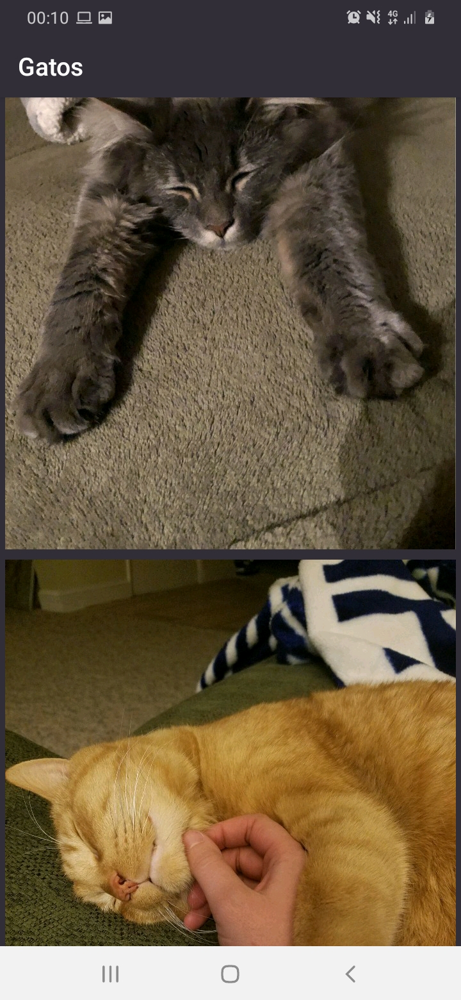

<h1 align="center">Cats Gallery</h1>
<h1 align="center">
    <a href="https://developer.android.com/kotlin/">🔗 Kotlin</a>
</h1>

Galeria de fotos de gatos, onde é possível verificar várias fotos de animais fofinhos

Pre Requisitos
=================
Guia de instalação de todas as ferramentas necessárias: https://developer.android.com/studio/install?hl=pt-br

Fotos da Aplicação
=================

<h1 align="center">
  
</h1>
